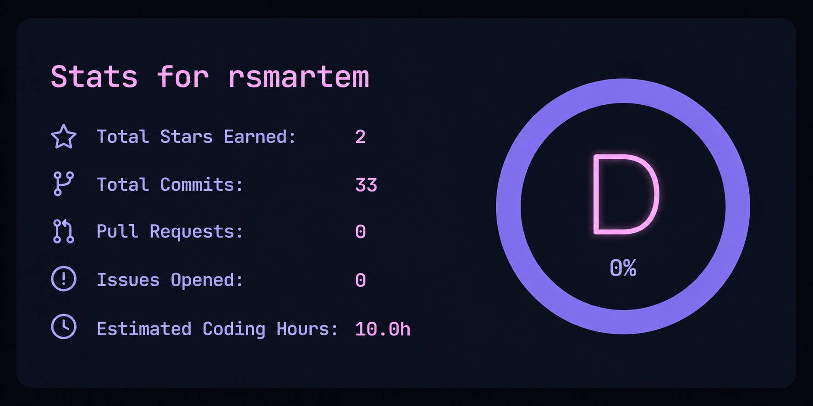

  <!-- Main top neon banner from your repository -->
  

<h1 align="center">Hi there! I'm Artem 👋</h1>

<b>Python Developer / Linux Enthusiast</b>

Welcome to my GitHub profile! Here I share my projects, experiments, and open-source code.

 

---

### 🛠 Tech Stack:

  <!-- Иконка Python из репозитория Devicon -->
  
  <b>Programming Language:</b> Python

 

* 🐧 **Operating Systems:** Linux
* 🔧 **Developer Tools:** Git / GitHub

---

### 📊 GitHub Statistics:

  <!-- Твоя картинка статистики, сгенерированная в ChatGPT -->
  

---

### 🚀 Currently Working On:
* 🎯 **Learning:** Advanced Python backend concepts and system administration.
* 💻 **My Projects:** Building scripts, automation tools, and exploring open-source repositories.
* ⚡ **Fact about me:** I really love custom setups, dotfiles, and tweaking Linux environments.

---

### 📁 Featured Repositories:
* 🔹 **[HorXayah](https://github.com)** — My repository featuring HTML development. Feel free to check out the code!

---

### 📫 Connect with me:

  <!-- Your contact banner from photo2.png -->
  

